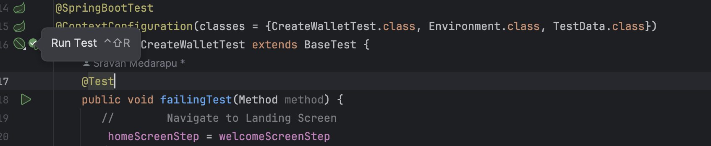
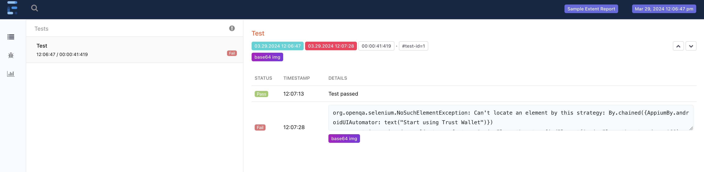

# Sample Mobile Framework

## Introduction:
Sample Mobile Test Framework to demonstrate Page Object Model with integration of Appium, TestNG, SpringBoot, Extent Report.

## Prerequisites
1. Install [Node.js](https://github.com/nodejs/help/wiki/Installation)
2. Set up the [Android SDK](https://developer.android.com/about/versions/14/setup-sdk).
3. Clone the project and navigate to its root directory.
```bash
git clone https://github.com/sravanmedarapu/appium-testng-spring-framework
```

---
### Steps for running test:
1. [Install Appium](https://appium.io/docs/en/2.0/quickstart/install/) and [UIAutomator2](https://appium.io/docs/en/2.0/quickstart/uiauto2-driver/)
    ```bash
    npm install -g appium
    appium driver install uiautomator2 
    ```
2. [Launch Android emulator](https://developer.android.com/studio/run/emulator-commandline)
3. Run Test 
  
   - Option1. command: ```mvn clean test```

   - Option2. Using IDE `src/test/java/tests/com/sample/test/CreateWalletTest.java`
             Refer 

4. Refer to Reports  `extent-reports/extent-report.html`
   - Sample Report can be found extent-reports/extent-report.html
   - Screenshot of the report 

*Note*: Test will launch the Appium server

### Config:
1. Appium config: src/test/resources/application-android.properties
 ```
deviceName=
platformVersion=
appActivity=.ui.app.AppActivity
appPackage=com.wallet.crypto.trustapp
app=trust-wallet.apk
platformName=Android
appiumLog=logs/appiumLog
fullReset=true
```

2. TestData src/test/resources/testdata.properties
```
passcode=123456
```
---

---


### Main stack:
1. Appium (mobile app automation)
2. TestNG (Test Framework)
3. Extent Report (Reporting)
4. SpringBoot (Dependency Injection)
---
### Future Improvements:
1. Device Manager: to orchestrate the devices lifecycle(launch, kill)
2. Parallel Execution: parallel thread count based on available emulators/devices
3. Attach Artifacts: Video, Logcat, page dump, e.t.c